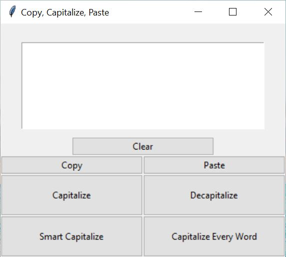

Introduction
============

This program is a Python GUI that can capitalize, decapitalize, and smart capitalize the content in your clipboard.

Requirements
============

To run the program, a Python interpreter of at least version 3.8 is needed.

This program uses the following libraries:

* `tkinter`
* `pyperclip`

Installation
============

Download this repository and run `Copy Capitalize Paste.pyw` as you would any Python file.

Configuration
==============

This module has no menu or modifiable settings.

Contact
=======

Daniel Di Giovanni - <dannyjdigio@gmail.com>

GitHub: <https://github.com/danpythonman>

LinkedIn: <https://www.linkedin.com/in/daniel-di-giovanni/>
